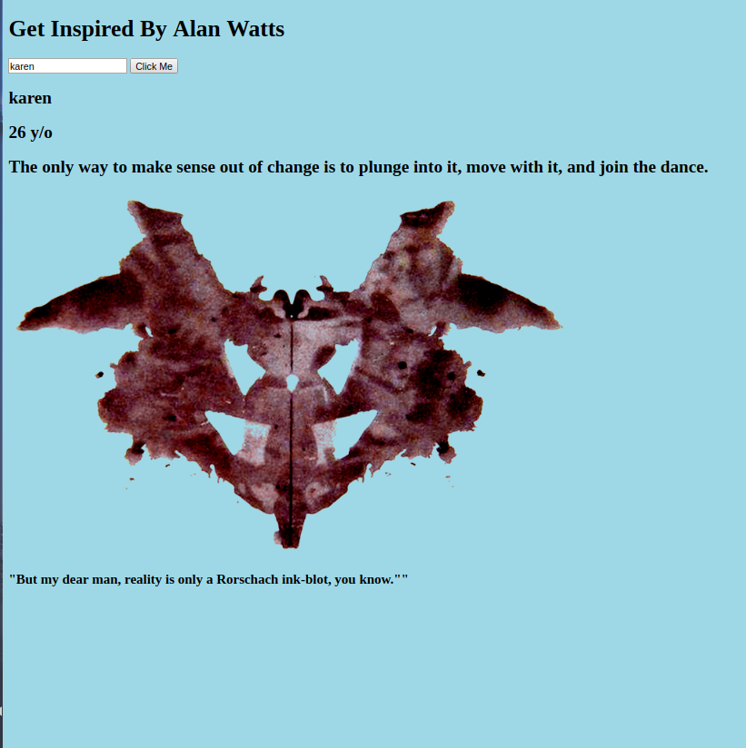
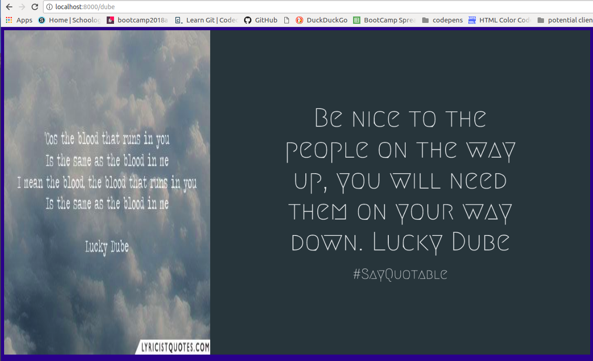
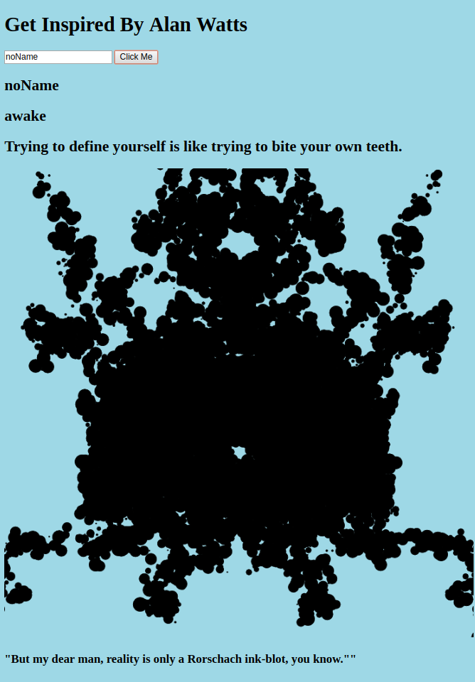

# My First API
*work in Progress*

I created an API that allows a user to enter a string, if the entry has a match then the matching object's data will be pulled from the data.json file and be displayed.
What Does the User See?
The user can see the name searched, the stored age, a quote,from the 70s Philosopher Alan Watts, and an image.This Web Application has three different endpoints, each directs you to another html file with it's own css and js files.

The second endpoint can be accessed by adding:/tolle to the url, this takes you to a page containing quotes from Eckhart Tolle's book: The Power of Now.

The last endpoint can be viewed by adding: /dube to the url, this leads you to a page with images containing quotes by the music reggae artist Lucky Dube.  

## How It's Made:

**Tech used:** HTML, CSS, JavaScript, nodeJS

I used HTML, CSS, JavaScript, along with nodeJS to develop a full stack application.

I had a lot of fun with this project, I'm a big fan of self empowerment and decided to include some amazing quotes as part of this demo. This demo includes wise words from one of my favorite philosophers Alan Watts, the author, Eckhart Tolle, who's books I can not get enough of, and the South African superstar Lucky Dube who's life was cut short due to violence.

## Instructions:

Entries accepted on the landing page: karen, noName, other searches will result in an unknown. Try it out!

## Lessons Learned:
I was having trouble with the images displaying on the third html file and realized I had to create endpoints for each image, just as I had done for each css, html, and js file.

During this project I worked through installing figlet via the command line and using it for my server's 404 response. This is way cooler than only displaying 404 as an integer, check it out!

**Link:** Coming Soon
